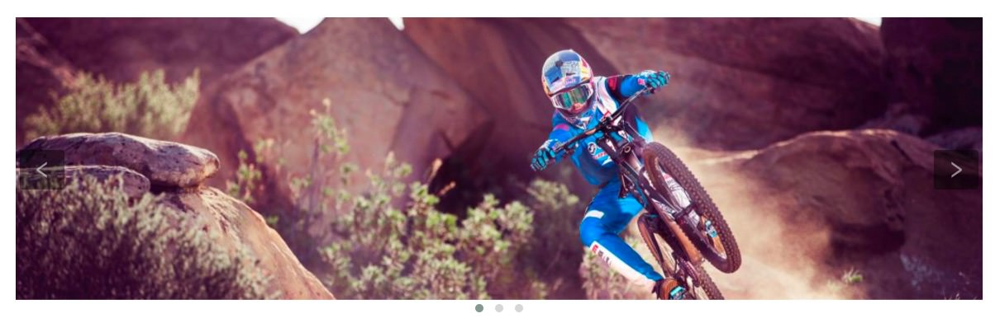

# Grav Shortcode Owl Carousel Plugin



## About

The **Shortcode Owl Carousel** plugin makes it trivial to create []Owl Carousel](https://owlcarousel2.github.io/OwlCarousel2/) based sliders from within your page content. Owl Carousel provides a wide range of features and functionality that are directly accessible via shortcode attributes.  Features include:

* Infinity Loop
* Center item
* Smart Speed
* Stage Padding
* Item Margin
* Ability to make almost all options responsive
* Various Widths
* Callback Events
* RTL
* YouTube/Vimeo/vzaar support (fetching thumbnails as well)
* Anchors navigation
* Merged Items
* and more...

## Installation

Typically a plugin should be installed via [GPM](http://learn.getgrav.org/advanced/grav-gpm) (Grav Package Manager):

```
$ bin/gpm install shortcode-grav-carousel
```

Alternatively it can be installed via the [Admin Plugin](http://learn.getgrav.org/admin-panel/plugins)


## Basic Example

This is a basic example that shows off how you can easily turn 3 images into a slider:

```
[owl-carousel items=1 margin=10 loop=true autoplay=true autoplayHoverPause=true nav=true]


[/owl-carousel]
```

In this examaple, we are wrapping 3 markdown-syntax images with the `[owl-carousel][/owl-carousel]` shortcode tag.  Then we are adding shortcode attributes to set some Owl Carousel options. 

## Advanced Example

Every first-level HTML element that gets rendered between the shortcode tags, is treated as a slider item.  This can be images, or even HTML div elements that allow for more complex content.  

```
[owl-carousel items=2 margin=10 loop=true]
<div style="background: url({{ page.media['image-1.jpg'].url }}) 50% 50%;background-size: cover;color:#fff;">
  <h2>This is panel 1</h2>
  <p>foo</p>
</div>
<div style="background: url({{ page.media['image-2.jpg'].url }}) 50% 50%;background-size: cover;color:#fff;">
  <h2>This is panel 2</h2>
  <p>foo</p>
</div>
<div style="background: url({{ page.media['image-3.jpg'].url }}) 50% 50%;background-size: cover;color:#fff;">
  <h2>This is panel 3</h2>
  <p>foo</p>
</div>
[/owl-carousel]
```

In this example, we put HTML div tags between the shortcode tags, and set the number of items to display to `2`, the margin between items to `10` and the loop option to `true`. We make use of Twig processing to dynamically add the URLs to the images that we are setting as the background of the divs.  Then inside of the divs, we have some HTML content.

| Note: Markdown is not able to be processed within HTML tags, but you can use Twig if you enable Twig processing in the page frontmatter.

## Owl Carousel Options

Options can be passed to Owl Carousel as attributes of the shortcode.  Numbers can be passed simply as `number=1`, booleans can be entered as `boolean=true`, and strings can be entered between quotes such as `string="foo"` or `string='foo'`.

The options available are fully documented on the OWL Carousel site: https://owlcarousel2.github.io/OwlCarousel2/docs/api-options.html, but a summary of the current ones appears below:

### items
Type: **Number**
Default: `3`

The number of items you want to see on the screen.

### margin
Type: **Number** 
Default: `0`

margin-right(px) on item.

### loop
Type: **Boolean** 
Default: `false`

Infinity loop. Duplicate last and first items to get loop illusion.

### center
Type: **Boolean**
Default: `false`

Center item. Works well with even an odd number of items.

### mouseDrag
Type: **Boolean** 
Default: `true`

Mouse drag enabled.

### touchDrag
Type: **Boolean** 
Default: `true`

Touch drag enabled.

### pullDrag
Type: **Boolean** 
Default: `true`

Stage pull to edge.

### freeDrag
Type: **Boolean**
Default: `false`

Item pull to edge.

### stagePadding
Type: **Number** 
Default: `0`

Padding left and right on stage (can see neighbours).

### merge
Type: **Boolean**
Default: `false`

Merge items. Looking for data-merge='{number}' inside item..

### mergeFit
Type: **Boolean** 
Default: `true`

Fit merged items if screen is smaller than items value.

### autoWidth
Type: **Boolean** 
Default: `false`

Set non grid content. Try using width style on divs.

### startPosition
Type: **Number/String**
Default: `0`

Start position or URL Hash string like '#id'.

### URLhashListener
Type: **Boolean**
Default: `false`

Listen to url hash changes. data-hash on items is required.

### nav
Type: **Boolean** 
Default: `false`

Show next/prev buttons.

### rewind
Type: **Boolean** 
Default: `true`

Go backwards when the boundary has reached.

### navText
Type: **Array** 
Default: `[&#x27;next&#x27;,&#x27;prev&#x27;]`

HTML allowed.

### navElement
Type: **String** 
Default: `div`

DOM element type for a single directional navigation link.

### slideBy
Type: **Number/String**
Default: `1`

Navigation slide by x. 'page' string can be set to slide by page.

### dots
Type: **Boolean** 
Default: `true`

Show dots navigation.

### dotsEach
Type: **Number/Boolean** 
Default: `false`

Show dots each x item.

### dotData
Type: **Boolean** 
Default: `false`

Used by data-dot content.

### lazyLoad
Type: **Boolean**
Default: `false`

Lazy load images. data-src and data-src-retina for highres. Also load images into background inline style if element is not 

### lazyContent
Type: **Boolean** 
Default: `false`

lazyContent was introduced during beta tests but i removed it from the final release due to bad implementation. It is a nice options so i will work on it in the nearest feature.

### autoplay
Type: **Boolean**
Default: `false`

Autoplay.

### autoplayTimeout
Type: **Number** 
Default: `5000`

Autoplay interval timeout.

### autoplayHoverPause
Type: **Boolean**
Default: `false`

Pause on mouse hover.

### smartSpeed
Type: **Number** 
Default: `250`

Speed Calculate. More info to come..

### fluidSpeed
Type: **Boolean**
Default: `Number`

Speed Calculate. More info to come..

### autoplaySpeed
Type: **Number/Boolean**
Default: `false`

autoplay speed.

### navSpeed
Type: **Number/Boolean** 
Default: `false`

Navigation speed.

### dotsSpeed
Type: **Boolean** 
Default: `Number/Boolean`

Pagination speed.

### dragEndSpeed
Type: **Number/Boolean**
Default: `false`

Drag end speed.

### callbacks
Type: **Boolean**
Default: `true`

Enable callback events.

### responsive
Type: **Object**
Default: `empty object`

Object containing responsive options. Can be set to false to remove responsive capabilities.

### responsiveRefreshRate
Type: **Number**
Default: `200`

Responsive refresh rate.

### responsiveBaseElement
Type: **DOM element**
Default: `window`

Set on any DOM element. If you care about non responsive browser (like ie8) then use it on main wrapper. This will prevent from crazy resizing.

### video
Type: **Boolean**
Default: `false`

Enable fetching YouTube/Vimeo/Vzaar videos.

### videoHeight
Type: **Number/Boolean** 
Default: `false`

Set height for videos.

### videoWidth
Type: **Number/Boolean**
Default: `false`

Set width for videos.

### animateOut
Type: **String/Boolean**
Default: `false`

Class for CSS3 animation out.

### animateInClass
Type: **String/Boolean** 
Default: `false`

Class for CSS3 animation in.

### fallbackEasing
Type: **String**
Default: `swing`

Easing for CSS2 $.animate.

### info
Type: **Function**
Default: `false`

Callback to retrieve basic information (current item/pages/widths). Info function second parameter is Owl DOM object reference.

### nestedItemSelector
Type: **String/Class** 
Default: `false`

Use it if owl items are deep nested inside some generated content. E.g 'youritem'. Don't use dot before class name.

### itemElement
Type: **String** 
Default: `div`

DOM element type for owl-item.

### stageElement
Type: **String**
Default: `div`

DOM element type for owl-stage.

### navContainer
Type: **String/Class/ID/Boolean**
Default: `false`

Set your own container for nav.

### dotsContainer
Type: **String/Class/ID/Boolean** 
Default: `false`

Set your own container for nav.

